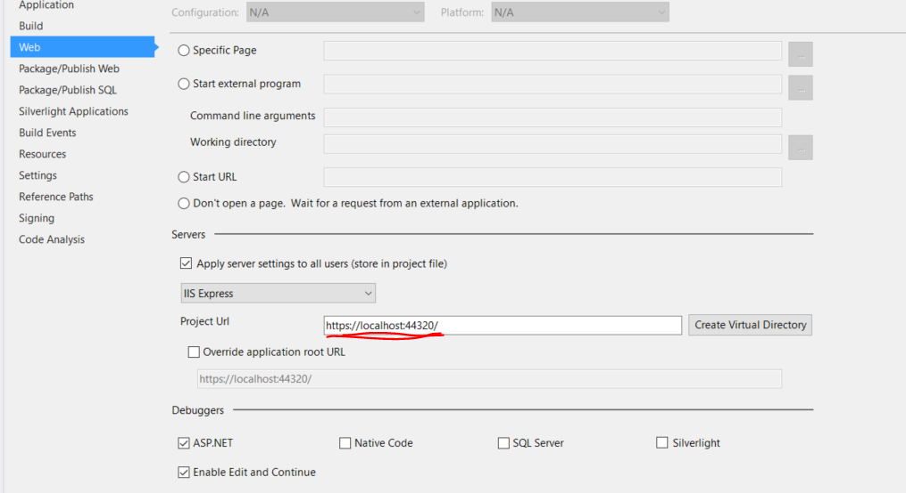
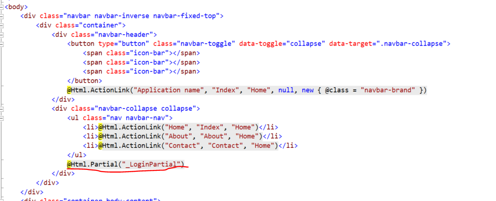
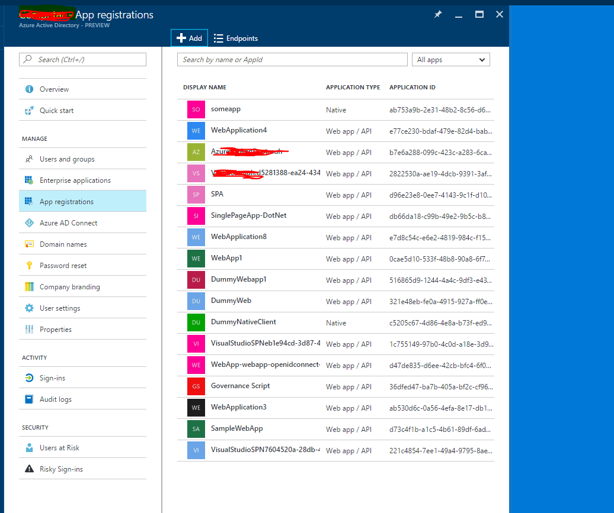

## Examining Application secured by Azure AD via Open ID Connect ##

1.  Open Web application from this link <https://github.com/Azure-Samples/active-directory-dotnet-webapp-openidconnect>

1. Right click on the solution and open Package Manager, highlight the following packages as they are used in the Application.
    * Microsoft.IdentityModel.Protocol.Extentions
    * System.IdentityModel.Token.Jwt
    * Microsoft.Owin.Security.OpenIdConnect
    * Microsoft.Owin.Security.Cookies
    * Microsoft.Owin.Host.SystemWeb
    
1. Right click on the solution, click on **Property -> Web** and note the Project URL of the web application. The application will run on this URL. In production, this can be different URL. For the purpose of this demonstration, we will use our localhost URL. 

1. Open Web.Config and highlight the following keys and explain their significance.  
    ```xml
    <appSettings>
      <add key="ida:ClientId" value="[Enter client ID as obtained from Azure Portal, e.g. 82692da5-a86f-44c9-9d53-2f88d52b478b]" />
      <add key="ida:Tenant" value="[Enter tenant name, e.g. contoso.onmicrosoft.com]" />
      <add key="ida:AADInstance" value="https://login.microsoftonline.com/{0}" />
      <add key="ida:PostLogoutRedirectUri" value="https://localhost:44320/" />  
    </appSettings>
    ```

1. Open **App\_Start -> Startup.Auth.cs** and show the static variable retrieving the app keys.

1. Navigate to **Startup.cs** and show to student Configuration method, Notice the IAPBuilder parameter. The method call another ConfigureAuth. Let us examine that method.

1. Go to **App\_Start -> Startup.Auth.cs** and examine ConfigureAuth method
    * `app.SetDefaultSignInAsAuthenticationType(CookieAuthenticationDefaults.AuthenticationType);` Called by middleware to change the name of the     AuthenticationType that external middleware should use when the     browser navigates back to their return url.
    * `app.UseCookieAuthentication(new CookieAuthenticationOptions());` Adds a cookie-based authentication middleware to your web application pipeline.
    ```c#
    app.UseOpenIdConnectAuthentication(
      new OpenIdConnectAuthenticationOptions
      {
         ClientId = clientId,
         Authority = authority,
         PostLogoutRedirectUri = postLogoutRedirectUri,
         RedirectUri = postLogoutRedirectUri,
         Notifications = new OpenIdConnectAuthenticationNotifications
         {
           AuthenticationFailed = context =>
           {
             context.HandleResponse();
             context.Response.Redirect("/Error?message=" + context.Exception.Message);
             return Task.FromResult(0);
           }
        }
      }
    );
    ```
    The above code tells the middle ware to use Open ID connect, and pass open id connect authentication option to the method.

    The option includes:  
      * **Client ID:** the client ID of Azure Application.  
      * **Authority**: is the URL <https://login.microsoftonline.com/{0}> where {0} is replaced with the domain of Azure AD  
      * **PostLogoutRedirectUri :** This is the URL which to which the browser will be redirected to after the user logged off  
      * **Notifications:** a class which tell the option id connect where to redirect errors.  

    Also, Examine the registration of this class "Startup" as startup class by examining the following attribute
    ```c#
    [assembly: OwinStartup(typeof(WebApp_OpenIDConnect_DotNet.Startup))]
    ```

1. Navigate to **Views -> _LoginPartial.cshtml** and examine the "if" condition  
    ```HTML+Razor
    @if (Request.IsAuthenticated)
    //If the use is already sign in then the username is displayed
    //Otherwise an action link will be created with account controller
    in which singIn Method is called.
    ```

1. Navigate to **Controllers -> AccountController.cs** and show sign in and signout method to the students.

1. Navigate **shared -> _Layout.cshtml** and show the _loginPartial to students
  

## Registration the Web App in Azure AD (YourAzureAD.onmicrosoft.com) ##

1. Navigate to **Azure Portal** portal.azure.com and navigate to azure active directory blade.
1. Click on **App registration**, here you can see all the app which is registered with this Instance of Azure AD.
  

1. Enter the name of the new Application (this can be anything)-this name will show on sign in page.
1. Select **Web app/API** from **Type**.
1. Enter the sign in URL (from Step 1) and then hit create

After the Application is created open the App by double clicking on it and copy the following value

  * Application ID -> This is also called client ID. After copying this value, past it in the value section of **web.config** of the application in `ida:ClientId`
  * Copy the domain of your Azure AD in which this application is registered and past it in the value of section of `ida:Tenant`. Azure AD domain is usually in format of YourAzureADdomainName.onmicrosoft.com

## Running the application ##

Run the application, click on sign in and login into the application as one of the user in Azure AD
